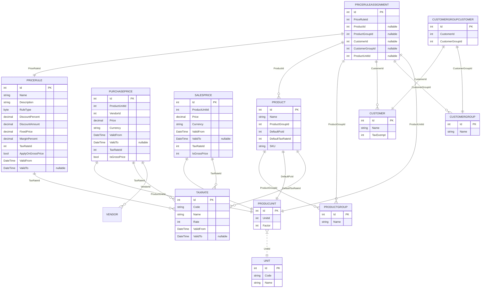

# ERD - NewDAL (renderable)

This file contains a Mermaid `erDiagram` block intended for direct rendering (no `?` or parentheses). Copy the entire fenced block into a Mermaid renderer (VS Code Mermaid Preview, mermaid.live, or GitHub) to view.

